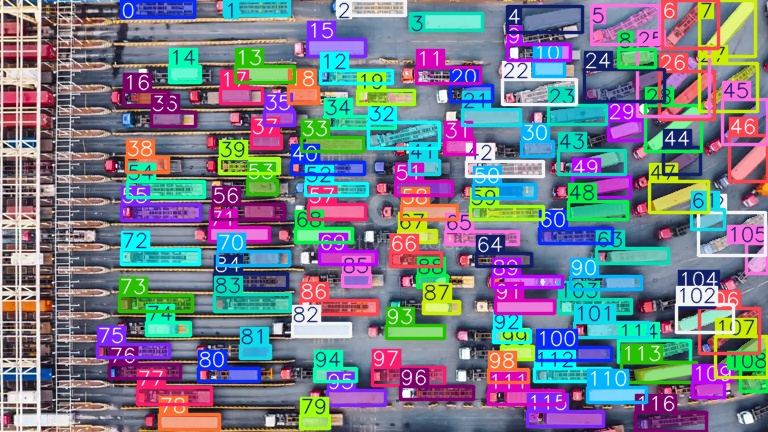
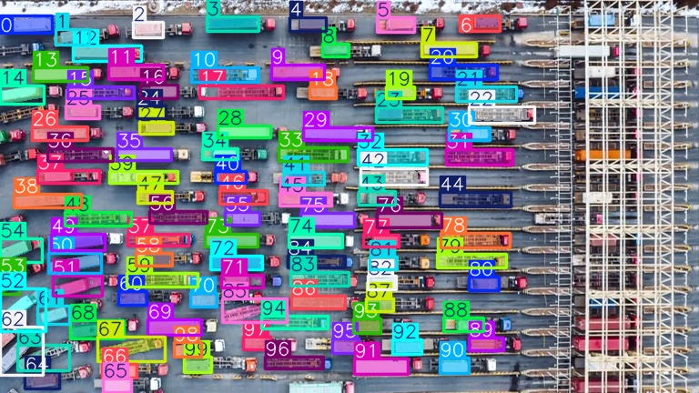
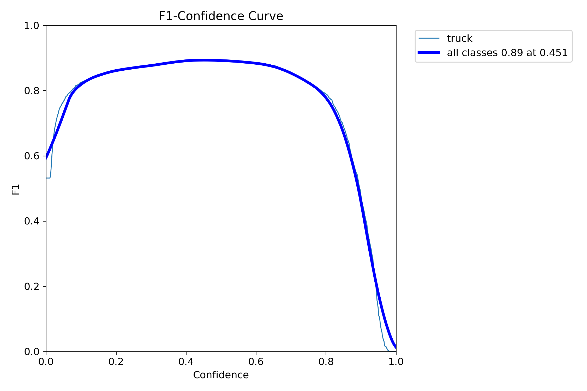
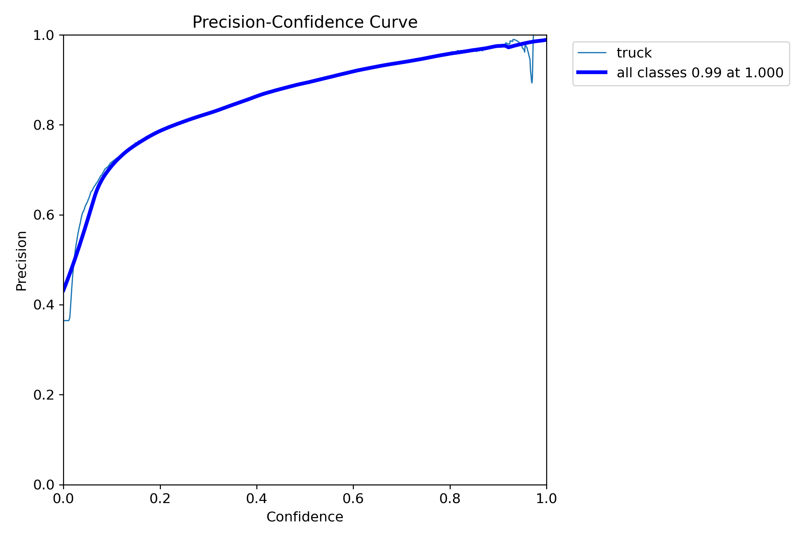
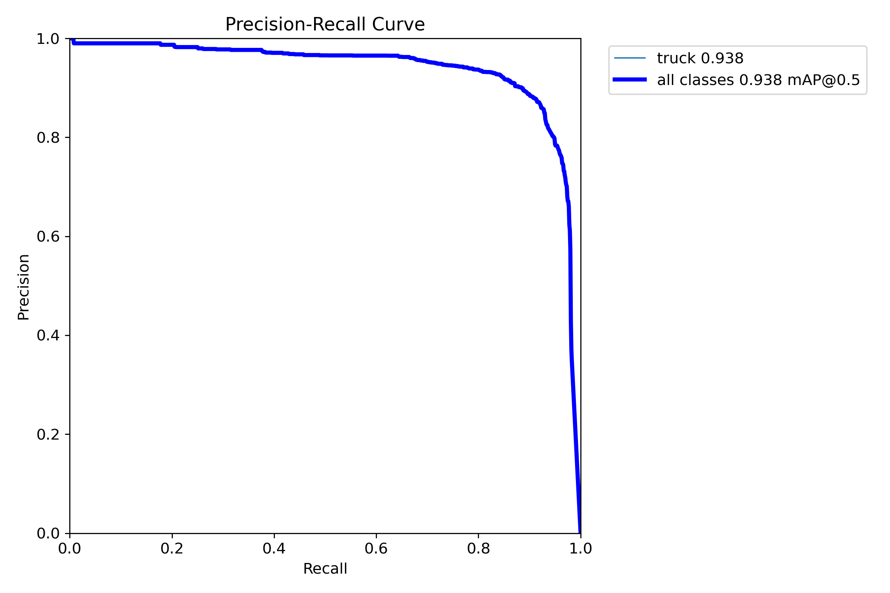
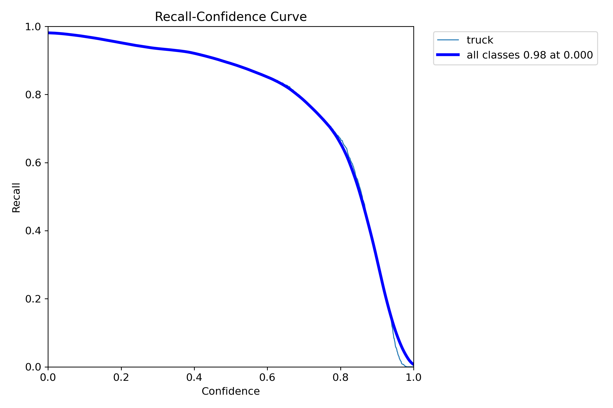
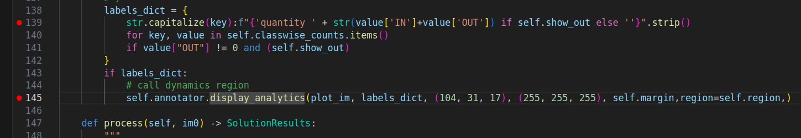
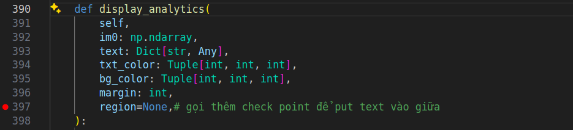
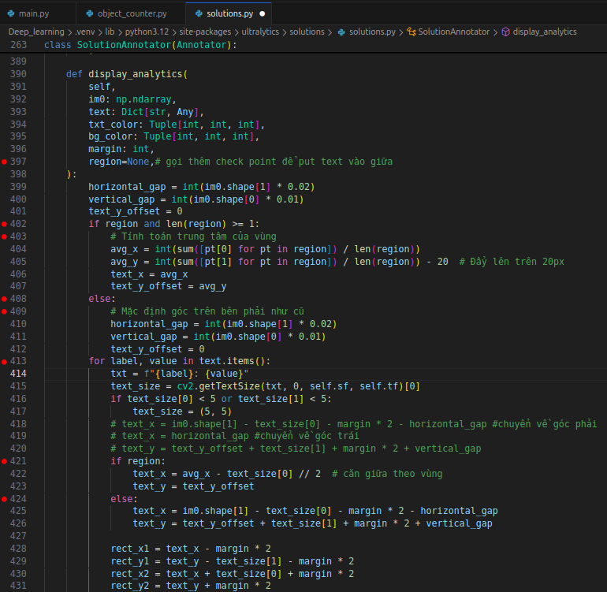

# Object Counting using Ultralytics YOLO11
use pretrained model YOLO11n detect and count the trucks

# Watch video

  

# 📊 Count trucks at border gates or BOT

Notebook: [📓 Xem tại đây](yolo.ipynb)

Or view with a nicer interface via 📘 [Mở notebook trên Colab (Google Drive)](https://colab.research.google.com/drive/16tjrC5jHRw7AiY6TwC7StqTqW0sK7NSN)

# Data

Cut 21 images from 3 video train 
<table align="center">
  <tr>
    <td align="center" width="45%">
       
      <em>Image train</em>
    </td>
    <td align="center" width="45%">
       
      <em>Image train</em>
    </td>
  </tr>
</table>

<table align="center">
  <tr>
    <td align="center" width="45%">
       
      <em>Image train</em>
    </td>
    <td align="center" width="45%">
       
      <em>Image train</em>
    </td>
  </tr>
</table>

Use POLYGON ROBOFLOW get region points object in image 
Then SAM2 draws bounding box around the object and I will have x (x position), y (y position), w(width object), h(height object). with each image containing about 100 objects.

<table align="center">
  <tr>
    <td align="center" width="45%">
       
      <em>SAM2</em>
    </td>
    <td align="center" width="45%">
       
      <em>SAM2</em>
    </td>
  </tr>
</table>

# Result train

<table align="center">
  <tr>
    <td align="center" width="45%">
       
      <em>SAM2</em>
    </td>
    <td align="center" width="45%">
       
      <em>SAM2</em>
    </td>
  </tr>
</table>

<table align="center">
  <tr>
    <td align="center" width="45%">
       
      <em>SAM2</em>
    </td>
    <td align="center" width="45%">
       
      <em>SAM2</em>
    </td>
  </tr>
</table>

# Change the source code a bit to make it more clear

<table align="center">
  <tr>
    <td align="center" width="45%">
       
      <em>object_counter.py</em>
    </td>
    <td align="center" width="45%">
       
      <em>solutions.py</em>
    </td>
  </tr>
</table>

  
  <em>solutions.py</em>

# Result after changing a little source code

  📺 <strong>Xem demo đếm xe bằng YOLO + SAM2</strong>

  

